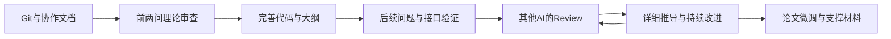

# CUMCM Source

数模国赛的开源工作资源，包含两部分：**LaTeX 论文模板**，以及 **Skills 与调用示例**。按目标与边界推进建模，用证明、代码和实验形成可核验的论文与支撑材料。

| 内容 | 入口 |
|---|---|
| 1. LaTeX 模板 | [源码与说明](latex-template/README.md) · [论文 PDF](latex-template/preview/main.pdf) · [AI 说明 PDF](latex-template/preview/ai-usage.pdf) |
| 2. Skills 及调用示例 | [技能入口](skills/cumcm-modeling/SKILL.md) · [Prompt 方法](skills/examples/prompt-workflow.md) · [调用示例](skills/examples/prompt-examples.md) |

```bash
git clone https://github.com/sakur7a/cumcm-source.git
cd cumcm-source
```

```text
cumcm-source/
├── latex-template/       # 可直接编译的中文论文模板
│   ├── main.tex          # 论文入口
│   ├── config.tex        # 题名、关键词与章节开关
│   ├── sections/         # 正文、参考文献与附录
│   ├── examples/         # 可运行的教学程序
│   ├── preview/          # 已编译PDF预览
│   └── build.py          # 离线构建入口
└── skills/
    ├── cumcm-modeling/   # 可安装的Codex技能
    └── examples/         # Prompt协作方法与调用示例
```

## 1. LaTeX 模板

模板参考已有数模论文的格式，自行实现排版配置，不依赖该项目，也不复制旧论文正文或未注明再分发许可的竞赛类文件。

- A4、四边25 mm，正文12.05 pt，行距倍率1.35。
- 摘要与关键词独占首页，无目录、无身份封面。
- 一级中文数字居中标题，下级编号为 `1.1`、`1.1.1`；页码底部居中。
- 重述、分析、假设、符号、各问模型、检验、评价分文件维护。
- AI声明位于参考文献前；证明、统计明细与必要源码放在附录。
- 三四问可配置关闭，系统字体缺失时回退到TeX字体。

### 编译与使用

需要 Python 3.9+ 和带有 XeLaTeX、CTeX/Fandol、TeX Gyre 及常用宏包的TeX发行版，无需Python第三方包或外部图片。

```bash
cd latex-template
python build.py
```

输出 `build/main.pdf` 和 `build/ai-usage.pdf`。没有Python时，可按 [模板说明](latex-template/README.md) 双遍运行XeLaTeX。

用于参赛项目时，复制整个 `latex-template` 目录为项目论文目录，先修改 `config.tex`，再填各章节。已有论文时先比较结构，避免覆盖原稿。

模板以解析教学问题展示“证明—程序—结果表”的对应关系，附录通过 `\lstinputlisting` 引入实际示例程序。模型、数据、图框和引用提示均需替换为真实内容；关闭 `draft` 提示不会自动删除教学内容。

### 验证与适用范围

作者Windows/XeLaTeX环境中的四问版、两问版和含空格路径隔离构建均通过；默认示例7页、AI说明1页，页面检查未发现缺字、溢出或未解析引用。其他系统及Overleaf尚未逐一实测。

字体回退可能改变字形和分页。模板是项目实践参考，格式、页数、身份处理和AI政策仍需按当届要求核对。

## 2. Skills 及调用示例

`cumcm-modeling` 将理论审查、算法优化、实验验证、论文对齐与代码支撑整理为可复用方法。没有模拟器的题目无需执行官方测试分支。

### 安装

在有 `skill-installer` 的Codex环境中发送：

```text
使用 $skill-installer，从 sakur7a/cumcm-source
安装 skills/cumcm-modeling 下的技能。
若已存在同名技能，先比较差异，保留我的本地修改。
```

也可将完整 `skills/cumcm-modeling` 文件夹复制到环境的个人技能目录，保留全部内部结构。作者当前环境使用 `~/.codex/skills/`；客户端加载位置及调用入口按当前环境和 [OpenAI技能文档](https://learn.chatgpt.com/docs/build-skills) 确认。`skills/examples` 是阅读材料，不是另一个待安装技能。

### 我的Prompt方式

使用自然对话按阶段推进，不要求先写一份完整的技术规范。作者的实际提示集中在六步：

1. 初始化Git，每次对话后更新；维护以题目为标题的工作文档和AGENTS，记录队号配置及题目特有要求。
2. 专注问题1和问题2，追问数学模型是否最优、自洽，有没有缺口，后续准备写论文。
3. 基于理论审查完善代码，并维护论文大纲。
4. 基于前两问完善后两问；题目有模拟器时，优先接口测试，探索自动化验证与自主迭代。
5. 查看其他AI对原始idea的review，判断有没有值得完善和优化的地方。
6. 维护完整详细的理论推导，附能核验的权威来源，对齐不确定处与论文，深入解决理论问题。

随后不断review、改进，再微调论文。技术检查与验证方法由助手负责落实，不包装成作者需要说出的prompt。完整总结见 [Prompt方式](skills/examples/prompt-workflow.md)。



例如理论审查直接这样说：

```text
使用 $cumcm-modeling。
现在专注问题1和问题2，关注其数学建模部分。
数学建模是否已经是最优了？理论逻辑是否自洽？
是否存在逻辑的缺口或者漏洞？后续需要写论文。
```

接着推进代码与大纲：

```text
基于这个完善下相应的代码，并维护一个论文大纲。
```

收到新的review后：

```text
这里有一份对原始idea的review，你查看一下是否有值得完善和优化的地方。
```

初始化、模拟器验证、详细推导及后续微调的完整示例见 [调用示例](skills/examples/prompt-examples.md)。示例队号用 `<参赛队号>`，不写入程序常量。新会话提供项目位置，先读AGENTS和工作文档恢复进度。

### 技能模块

| 模块 | 重点 |
|---|---|
| [理论审查](skills/cumcm-modeling/references/theory-review.md) | 假设、证明、反例、最优性目标和适用边界 |
| [算法与验证](skills/cumcm-modeling/references/algorithm-validation.md) | 固定开发集、独立确认、压力测试与完整统计 |
| [官方测试](skills/cumcm-modeling/references/official-testing.md) | 授权、预检、未知动作、退出与导出闭环 |
| [论文与交付](skills/cumcm-modeling/references/paper-delivery.md) | 真实结果、源码附录、支撑材料与AI披露 |
| [工作账本](skills/cumcm-modeling/assets/work-ledger-template.md) | 项目状态、证据映射与下一步 |

结构和链接检查不等于模型行为评测。技能不自动读取旧聊天、不保证全局最优或比赛成绩；高精度复算、实验均值和本地模拟都有各自的证据边界。

### 维护与贡献

仓库是维护主来源，个人技能目录是安装副本。更新仓库后需比较并同步安装文件；论文模板单独同步，不自动覆盖项目原稿。

欢迎提交 [Issue](https://github.com/sakur7a/cumcm-source/issues) 或PR，附版本、环境、最小复现提示、预期与实际行为，以及脱敏证据。通用经验进入本仓库，题目参数和真实成绩留在各自项目。

Git使用用户现有身份，不额外要求匿名；代码支撑按具体要求处理。密钥、私有配置和官方原始日志不进入公开仓库，有限次数正式测试必须明确授权。

本仓库自编文档、技能、脚本和模板采用 [MIT License](LICENSE)，TeX组件遵守各自许可证。
